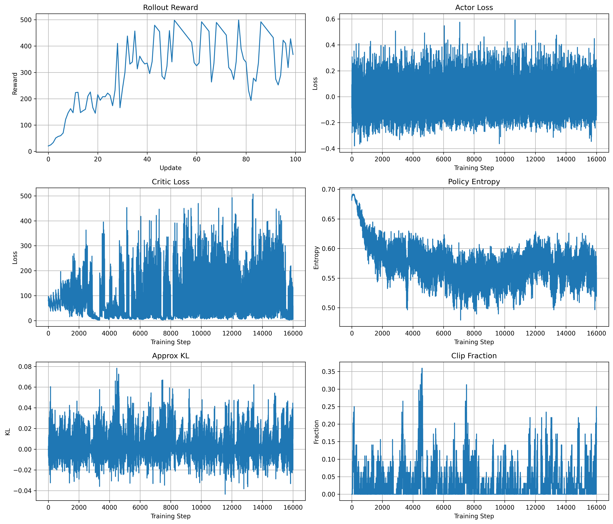

# RL Toy: PPO on CartPole

A modular PPO implementation on CartPole, built as a foundation toward RLHF-style reinforcement learning pipelines.

## Project Overview

This repository contains a modular implementation of Proximal Policy Optimization (PPO) trained on CartPole-v1.

The goal of this project is not only to solve CartPole, but also to build a clean and extensible reinforcement learning codebase that can later evolve toward RLHF-style training pipelines for large language models.

Instead of relying on existing RL libraries, the PPO algorithm is implemented from scratch, including:

- rollout collection
- generalized advantage estimation (GAE)
- clipped PPO objective
- actor-critic training
- entropy regularization
- minibatch PPO updates
- experiment logging and visualization

## PPO Overview

PPO (Proximal Policy Optimization) is an on-policy reinforcement learning algorithm that improves policy stability by constraining overly large updates.

The training pipeline consists of:

1. Collect trajectories using the current policy
2. Estimate advantages with GAE
3. Compute policy ratios between old and new policies
4. Apply the clipped surrogate objective
5. Update actor and critic networks using minibatch optimization

The PPO clipped objective is:

$$
L_{clip}(\theta) = E[\min(r_t(\theta) A_t,
\mathrm{clip}(r_t(\theta), 1-\epsilon, 1+\epsilon) A_t)]
$$

where:

$$
r_t(\theta) =\frac{\pi_{\theta}(a_t|s_t)}
{\pi_{\theta \ \mathrm{old}}(a_t|s_t)}
$$

## PPO vs REINFORCE

This project originally started from a vanilla REINFORCE implementation and was gradually extended into PPO.

Compared with REINFORCE, PPO introduces several important improvements:

| REINFORCE | PPO |
|---|---|
| Monte Carlo returns | GAE advantage estimation |
| High variance | Lower variance |
| No critic | Actor-Critic |
| Unstable updates | Clipped policy updates |
| Single trajectory optimization | Minibatch PPO updates |
| No trust region | Approximate trust region |

PPO significantly improves training stability and sample efficiency compared with vanilla policy gradient methods.

## Code Structure

```text
src
├── algorithms      # PPO-related functions
├── buffers         # Rollout buffer
├── envs            # Environment creation
├── networks        # Actor and critic networks
├── trainers        # PPO training loop
├── utils           # Seed || plotting || logging
└── run_ppo_cartpole.py
```

- algorithms: PPO core components such as GAE and action evaluation
- buffers: rollout storage
- networks: policy and value networks
- trainers: PPO optimization loop
- utils: experiment utilities

## Training Curves

The training process logs:
- episodic reward
- actor loss
- critic loss
- entropy
- approximate KL divergence
- clip fraction



## Training Analysis

The episodic reward increases rapidly and eventually reaches the maximum CartPole reward, indicating that the PPO agent successfully learns a stable balancing strategy.

Policy entropy gradually decreases during training, showing that the policy becomes more deterministic as learning progresses.

The critic loss fluctuates more strongly than the actor loss because value estimation targets continuously change during training.

Approximate KL divergence and clip fraction help monitor the magnitude of policy updates and prevent destructive policy shifts.

## From CartPole PPO to RLHF

This repository can also be viewed as a toy prototype of RLHF-style PPO training.

CartPole PPO:

state -> action -> environment reward

RLHF PPO:

prompt -> generated response -> reward model score

Both systems rely on:

- old log probabilities
- advantage estimation
- policy ratio computation
- clipped policy updates
- value function learning
- entropy regularization

## Install PyTorch (CUDA)

pip install torch torchvision torchaudio \
    --index-url https://download.pytorch.org/whl/cu124

## Install other dependencies

pip install -r requirements.txt